ClientLink — AWS 3-Tier Cloud Infrastructure

A secure, scalable, and fault-tolerant cloud infrastructure built on AWS for a customer management portal. Designed and deployed manually via the AWS Management Console — every decision made from scratch, no step-by-step tutorials followed.


Live Portal

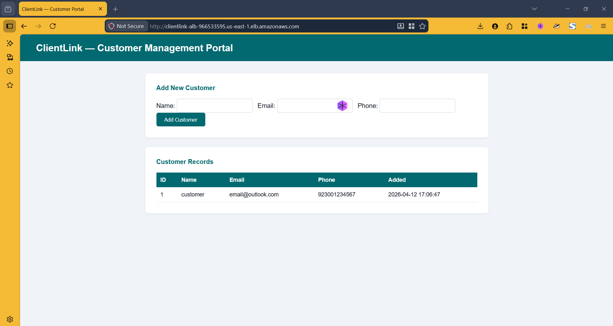

The finished portal running behind an Application Load Balancer. EC2 serves the frontend. RDS MySQL handles customer data in a private subnet with no public internet access.


Architecture

```
Internet
    │
    ▼
Internet Gateway (ClientLink-igw)
    │
    ▼
Application Load Balancer — Public Subnet (us-east-1a)
    │
    ▼
EC2 t3.micro — Apache + PHP — Public Subnet
    │                             │
    ▼                             ▼ (outbound only)
RDS MySQL — Private Subnet     NAT Gateway — Public Subnet
(No public IP. BackendSG only)
```


## Step 1 — VPC

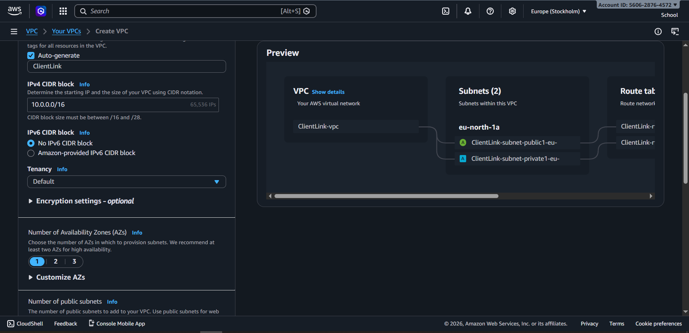
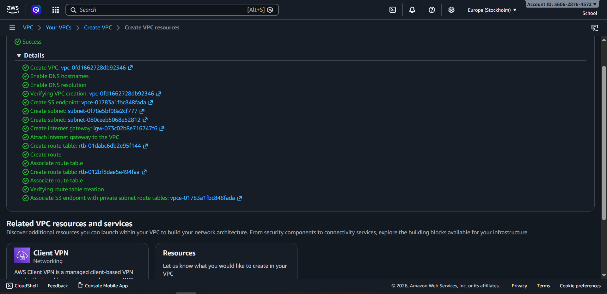

| Resource | Name | Value |
|----------|------|-------|
| VPC | ClientLink-vpc | 10.0.0.0/16 |
| Public Subnet | ClientLink-subnet-public1-us-east-1a | 10.0.1.0/24 |
| Private Subnet | ClientLink-Private-2b | 10.0.2.0/24 |


## Step 2 — Subnets

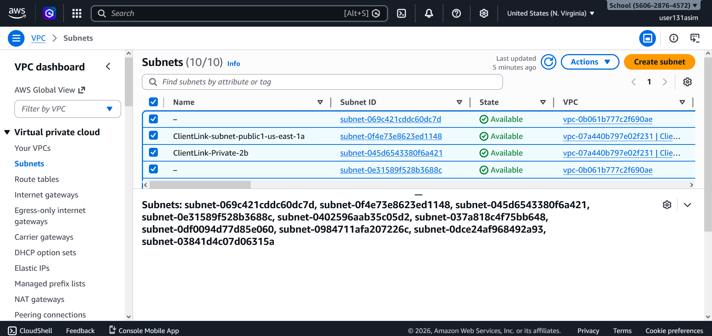

Public subnet hosts EC2 and ALB. Private subnet hosts RDS — no route to or from the internet.


## Step 3 — Internet Gateway

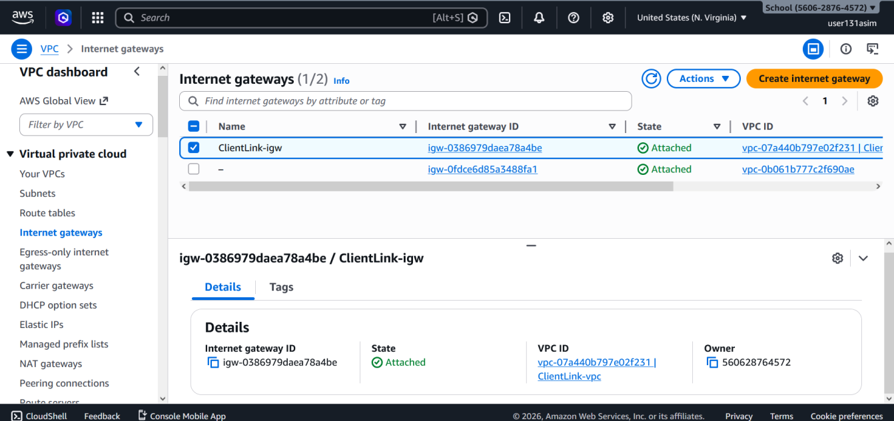

ClientLink-igw attached to the VPC. Allows the public subnet to communicate with the internet.


## Step 4 — NAT Gateway

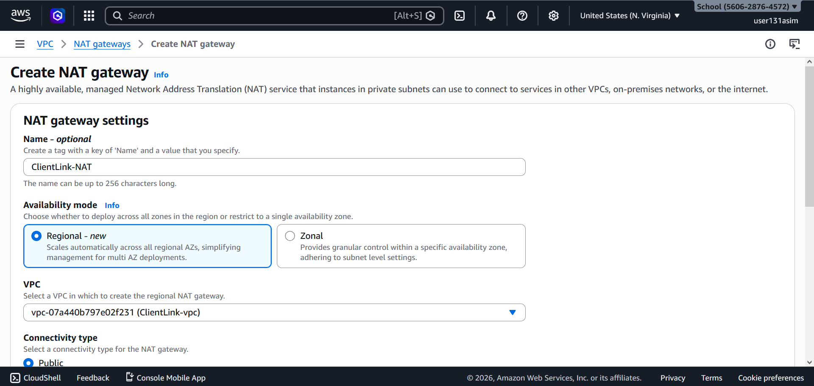
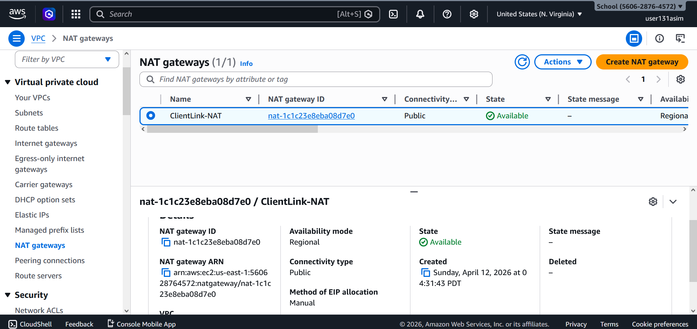

NAT Gateway placed in the **public subnet** with an Elastic IP. Private subnet resources can make outbound requests but remain unreachable from the internet.

> First mistake made here — originally placed the NAT Gateway in the private subnet. Fixed by deleting it and recreating in the public subnet. See Problems section.


## Step 5 — IAM

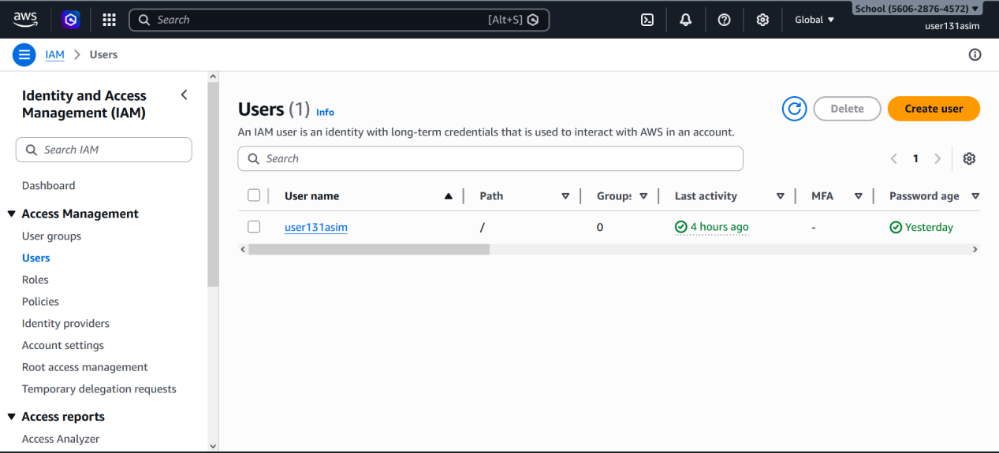

IAM Role attached to EC2 for RDS authentication. No hardcoded credentials anywhere in the stack.


## Step 6 — Security Groups

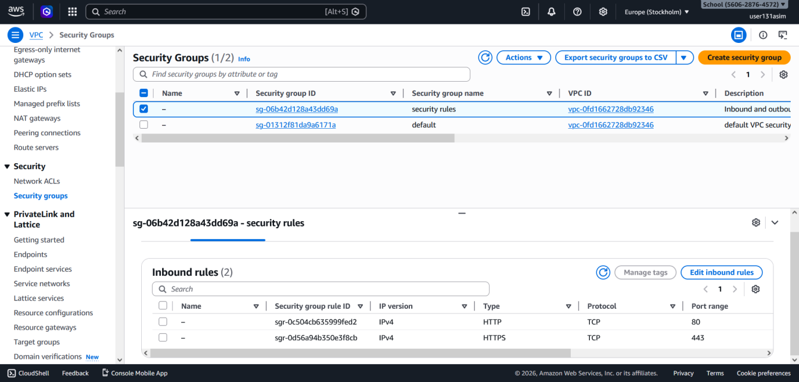
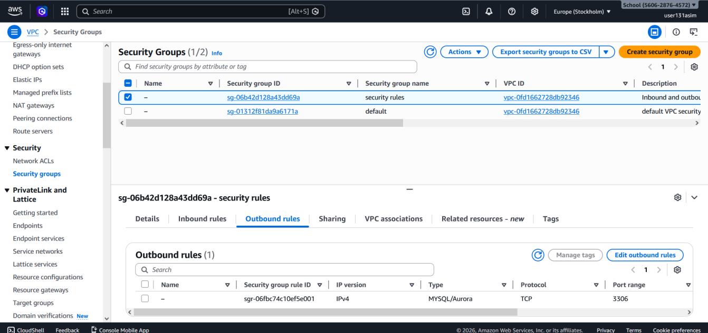

FrontendSG (EC2): HTTP port 80, HTTPS port 443 open. SSH restricted to My IP only.

BackendSG (RDS): MySQL port 3306 open to FrontendSG by Security Group ID — not by IP address. Only EC2 instances inside FrontendSG can reach the database.


## Step 7 — RDS Database


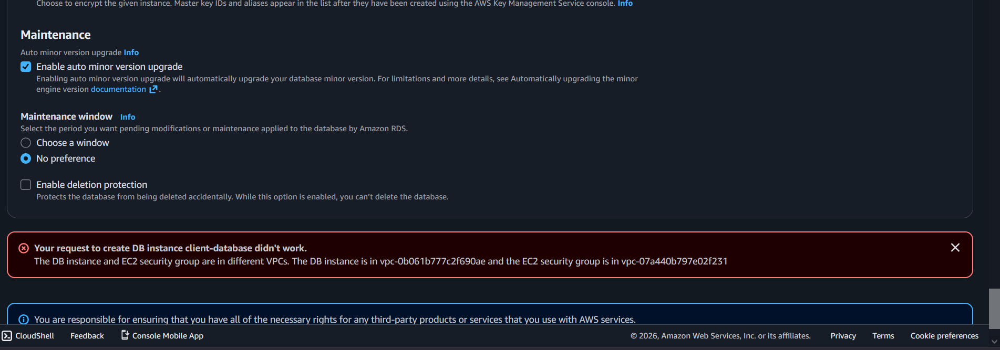
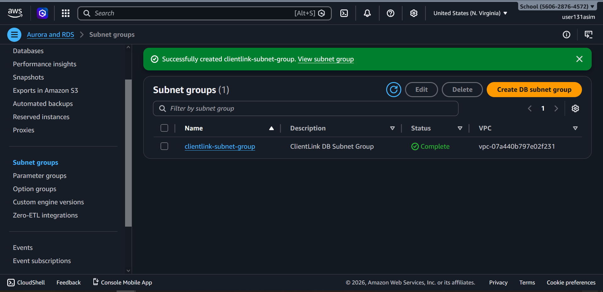

- Engine: MySQL 8.4
- Subnet: Private (no public access)
- Security Group: BackendSG
- Auth: IAM Role — no password in code
- DB Subnet Group: clientlink-subnet-group spanning multiple AZs


## Step 8 — EC2 Instance

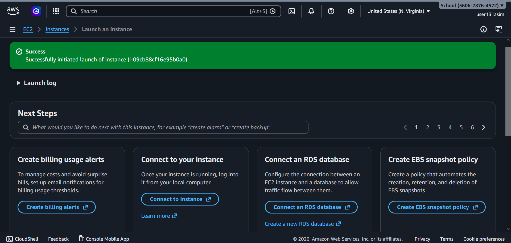
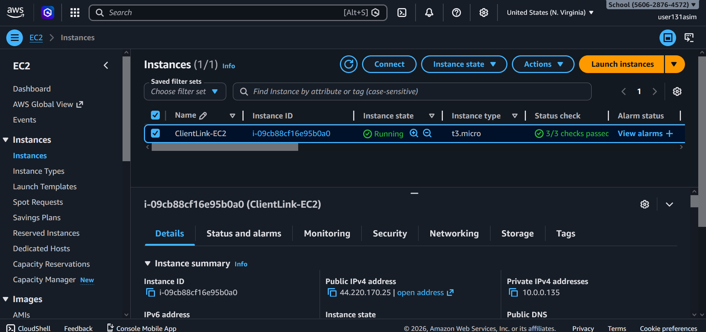

- Instance: ClientLink-EC2 (i-09cb88cf16e95b0a0)
- Type: t3.micro
- Subnet: Public
- Application: Apache + PHP installed and running


## Step 9 — Launch Template & Auto Scaling

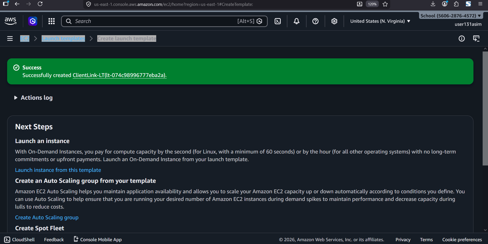
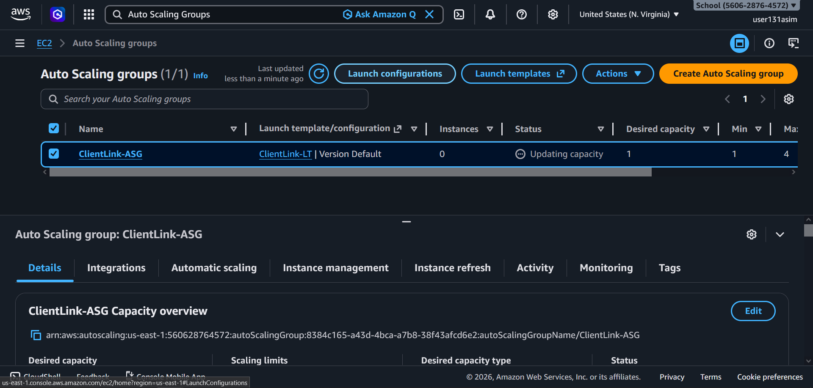

- AMI created from configured EC2 instance
- Launch Template: ClientLink-LT
- Auto Scaling Group: ClientLink-ASG — Min 1, Max 4 instances
- Scaling policy: Target tracking based on CPU utilisation


## Step 10 — Load Balancer

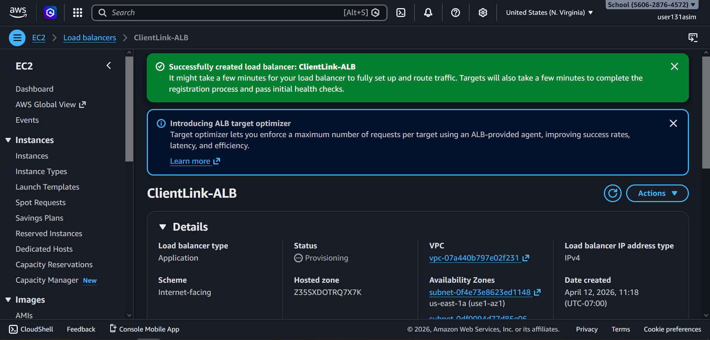

- Application Load Balancer: ClientLink-ALB
- Internet-facing, deployed across public subnets
- Routes traffic to Auto Scaling Group


## Step 11 — CloudWatch Monitoring

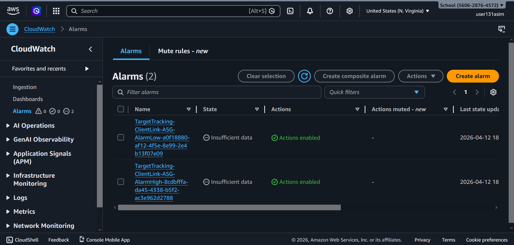

Two target tracking alarms configured:
- **AlarmHigh** — triggers scale-out when CPU is high
- **AlarmLow** — triggers scale-in when load drops


## Step 12 — Verification

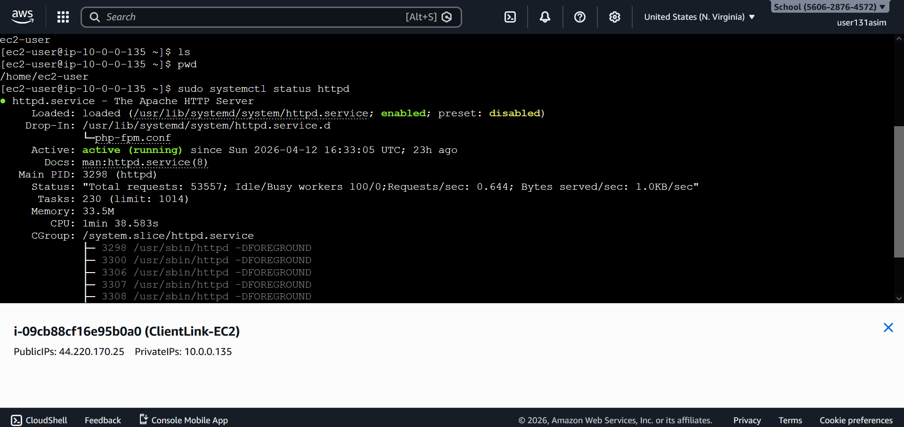
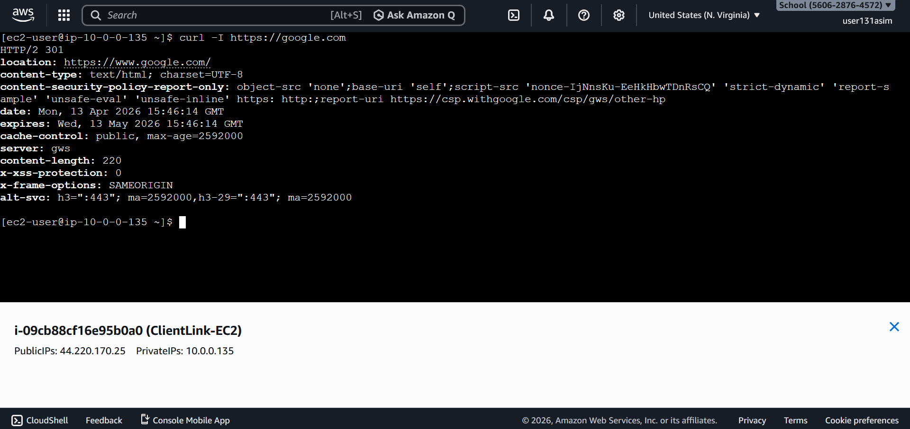

Apache confirmed running on EC2. Curl test from the instance confirms outbound internet connectivity via NAT Gateway. Portal confirmed loading via ALB endpoint.


Problems I Hit and Fixed

**Problem 1 — NAT Gateway in wrong subnet**
Placed it in the private subnet. Private resources had no outbound internet access.
Fix: Deleted it, reallocated Elastic IP, recreated in the public subnet.

**Problem 2 — Wrong AWS region**
Built everything in eu-north-1 (Stockholm) instead of us-east-1. Resources were invisible when switching region.
Fix: Deleted all resources, confirmed region selector set to us-east-1, rebuilt from scratch.

**Problem 3 — RDS subnet group error**
RDS creation failed even with correct VPC and security group.
Fix: Created a dedicated DB subnet group (clientlink-subnet-group) covering subnets in different Availability Zones. RDS requires this even on Free Tier.

**Problem 4 — Portal not loading in browser**
Apache was running, EC2 was up, but browser timed out.
Fix: Auto-assign public IPv4 was disabled on the public subnet. Enabled it in Subnet Settings and relaunched the instance.

**Problem 5 — SSH open to all IPs**
Security group had SSH set to 0.0.0.0/0 by mistake.
Fix: Restricted SSH source to My IP only.


Full Tech Stack

| Service | Purpose |
|---------|---------|
| VPC (10.0.0.0/16) | Network isolation |
| Public + Private Subnets | Layer separation |
| Internet Gateway | Public internet access |
| NAT Gateway + Elastic IP | Outbound-only private access |
| Route Tables | Traffic routing |
| Security Groups (FrontendSG, BackendSG) | Least-privilege access control |
| EC2 t3.micro | Web server — Apache + PHP |
| RDS MySQL 8.4 | Database — private subnet |
| IAM Role | Credential-free authentication |
| AMI | Base image for scaling |
| Launch Template (ClientLink-LT) | Auto scaling configuration |
| Auto Scaling Group (1–4) | Fault tolerance |
| Application Load Balancer | Traffic distribution |
| CloudWatch Alarms | Scaling triggers |


Author

**Muhammad Asim**
CS Student | University of Central Punjab, Lahore 
Cloud Engineer | AWS
[LinkedIn](https://www.linkedin.com/in/Asim-Muhammad0) | [Medium](https://medium.com/@Asim-Muhammad)
